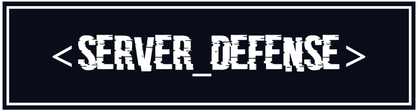

# <Server_Defense>

Viruses have breached your network, and it's your job to protect your server in this Tower Defense game. <Server_Defense> will land you as System Administrator for a network. Use the command terminal to control all your assets, deploy security programs and protect the server from incoming malware.

This is a game being developed by students from <a href="https://www.imagecampus.edu.ar/">Image Campus</a>

   

## Credits

- **Matias Pedro Karplus** - *Programming*
- **Ignacio Fernandez Lemos** - *Additional Programming*
- **London Cruz** - *Art*
- **Luciano Paladini** - *Art*
- **Lucas Quiñones** - *Art*
- **Mariangeles Burgos** - *Audio*
- **Matias Iannone** - *Audio*
- **Patricio Spadavecchia** - *Audio*
- **Nahuel Elias Coronel** - *Testing*
- **Lucas Di Falco** - *Testing*
- **Ignacio Ferrin** - *Testing*
- **Facundo Perea Fernandez** - *Testing*
- **Juan Ignacio Vera** - *Testing*

This game was also possible thanks to the support of these professors:

- **Sergio Baretto**
- **Ramiro Cabrera**
- **Ignacio Mosconi**
- **Lucía Inés Patetta**
- **Nazareno Rivero**
- **Eugenio Taboada**

## Acknowledgements

- **Ramón Bunge**
- **Juan Cruz Tourret**
- **Nicolás Jimenez Lamberti**
- **Federico Olivé**

- **Miguel Karplus**

## Links

Download it from itch.io: https://havensurgesw.itch.io/server-defense
